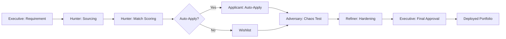

# 🎯 BountyHunter: The Agentic Career OS
**A high-performance, reference implementation for autonomous professional trajectory management.**


[](https://www.docker.com/)
[](https://fastapi.tiangolo.com/)
[](https://playwright.dev/)
[](https://serpapi.com/)

---

## 📜 The Manifesto
**BountyHunter is not a "spray-and-pray" automation tool.** 

We believe that job searching should be a targeted operation, not a numbers game. Most AI tools flood recruiters with low-quality applications; BountyHunter does the opposite. It uses a **Council of Agents** to act as a high-fidelity filter, ensuring that only the most strategic opportunities reach your desk.

**The Core Principle:** AI evaluates, recommends, and prepares; the Human decides and acts. We provide the intelligence and the evidence, but you retain the agency.

---

## 🏗️ System Pipeline (The Enterprise Loop)
BountyHunter operates on a closed-loop governance model to ensure architectural rigor and zero-hallucination sourcing.



---

## 🛠️ Capabilities Matrix

| Agent | Role | Enterprise Capability | Outcome |
| :--- | :--- | :--- | :--- |
| **The Executive** | Project Manager | Requirements Analysis & Quality Gates | Strategic Alignment |
| **The Hunter** | Sourcing Specialist | Real-time Web-Scale Sourcing & Evidence Capture | High-Fidelity Leads |
| **The Adversary** | Chaos Engineer | Adversarial API Testing & Edge-Case Discovery | System Rigor |
| **The Refiner** | Optimization Expert | Vulnerability Patching & Performance Tuning | Hardened Infrastructure |
| **The Designer** | Brand Identity | UI/UX Audit & Brand Consistency Enforcement | Executive Aesthetics |

---

## 📂 Project Blueprint
```text
bounty-hunter/
├── app/
│   ├── agents/             # The Council of Agents (Executive, Hunter, Adversary, etc.)
│   ├── api/                # High-performance FastAPI endpoints
│   │   └── endpoints/      # Modular route handlers for Profile, Filters, and Agents
│   ├── core/               # System configuration and environment management
│   ├── models/             # SQLAlchemy ACID-compliant data models
│   └── schemas/            # Pydantic data validation layers
├── docs/                   # Technical Wiki and Governance Models
│   └── wiki/               # Fundamentals, Backend, Infra, and Agentic Systems
├── frontend/               # Executive Suite Dashboard (Vue.js + Tailwind)
└── static/                 # Evidence store and brand assets
```

---

## 🚀 Quick Start Guide

### 1. Prerequisites
- Docker & Docker Compose
- A [SerpApi Key](https://serpapi.com/)

### 2. Launch Sequence
```bash
# Clone the HQ
git clone https://github.com/iconicwolf/bounty-hunter.git
cd bounty-hunter

# Configure the environment
cp .env.example .env
# Edit .env and insert your SERPAPI_KEY

# Deploy the system
docker-compose up --build -d
```

### 3. Operational Flow
1. **Identity Sync**: Open `frontend/index.html` and define your **Professional Persona**.
2. **Parameter Set**: Configure your **Strategic Keywords** and **Target Geographies**.
3. **Deploy Hunter**: Initiate the sourcing cycle.
4. **Review Bounties**: Analyze high-match roles and their visual evidence.

---

## 💰 Running on a Budget
BountyHunter is designed to be resource-efficient.
- **SerpApi**: Use the free tier for initial testing (100 searches/month).
- **Docker**: The system uses a lightweight PostgreSQL image to minimize RAM usage.
- **Localhost**: The entire suite runs locally, ensuring your professional data never leaves your machine except for the encrypted API calls to search providers.

---

## 🎓 Learning Center
This project serves as a reference implementation for **Agentic Governance**. Explore the `docs/` folder for a deep dive into:
- **TECHNICAL_GUIDE.md**: Ground-up explanation of MVC and Agentic Loops.
- **Governance Model**: How the Executive/Council hierarchy prevents AI hallucinations.
